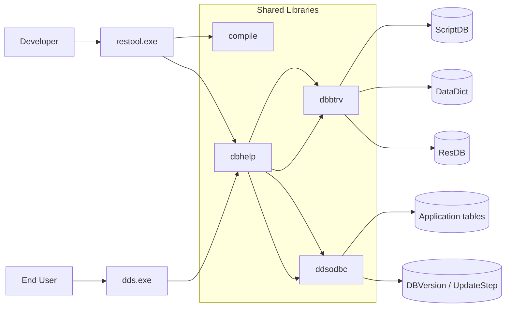
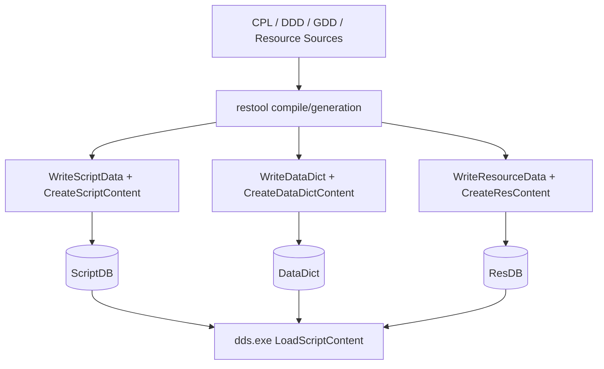

# ipos_kernel Architecture

## Scope

This document summarizes the architecture of the legacy DDS platform in `V200/V200.SRC`, with focus on:

- `dds.exe` runtime
- `restool.exe` IDE/tooling
- persistence model around `ScriptDB`, `DataDict`, and `ResDB`
- concrete DBBTRV operation usage reachable from RESTOOL flows

---

## 1) High-level system

The codebase builds a Win32 desktop stack with one main runtime executable and one development IDE executable:

- **`dds.exe`** (target `DDSMain`, output name `dds`)
  - end-user runtime
  - loads compiled script metadata/content and runs business logic
- **`restool.exe`** (target `restool`)
  - developer IDE for the CPL (Component Programming Language)
  - compiles/transforms sources and persists artifacts

Core shared libraries relevant to this area:

- **`dbhelp`**: table admin, request building, helper APIs for script/resource/datadict IO
- **`dbbtrv`**: Btrieve-backed DB implementation (`DBCall`, `DataRes_*`, `DataDict_*`)
- **`compile`**: compiler/transpilation pipeline consumed by RESTOOL and DDS

Backend routing is configurable via `DataBase` INI settings:

- `ResourceDLL` -> backend for `ScriptDB`/`ResDB`/`DataDict`
- `DefaultDLL` -> backend for `DBVersion`/`UpdateStep` and default transactional calls

---

## 2) Build topology in `V200/V200.SRC`

Parent CMake config declares:

- `DDSMain` executable (output `dds.exe`)
- many shared modules (`dbhelp`, `dbbtrv`, `ddsseq`, etc.)
- `restool` executable

Key project definitions:

- `V200/V200.SRC/CMakeLists.txt`
- `V200/V200.SRC/restool/CMakeLists.txt`
- `V200/V200.SRC/dbhelp/CMakeLists.txt`
- `V200/V200.SRC/dbbtrv/CMakeLists.txt`

`restool` links against `dbhelp`, `compile`, `ctool`, `frmobj`, `toolbar`, `statbar`, `dbclean`, and Win32 UI libs.

---

## 3) Persistence model used by RESTOOL + DDS

`dbhelp/RESSQL.CPP` defines SQL-style table metadata for core resource tables:

- **ScriptDB**
  - keys: autoincrement `Nummer`, unique (`Type`, `fName`)
  - stores script payload as blob (`Data`)
- **ResDB**
  - same structural pattern as ScriptDB for resource blobs
- **DataDict**
  - stores table definitions/version metadata (`TableID`, `Version`, parent info, `Data` blob)
- **DBVersion**, **UpdateStep**
  - lifecycle/update metadata
  - defined on the **DefaultDLL** path (not ResourceDLL)

RESTOOL artifact mapping:

- CPL compile artifacts -> **ScriptDB**
- DDD/GDD dictionary artifacts -> **DataDict**
- binary resources (bitmap/wmf/content) -> **ResDB**
- DB lifecycle/version metadata -> **DBVersion/UpdateStep** (primarily runtime/update layer via DefaultDLL)

DDS runtime startup loads and uses this persisted state (for example via `LoadScriptContent()`, `ReadDataDict()` checks for update flags).

### 3.1 SEQ file format specification (`ddsseq`)

This section documents the currently implemented SEQ layout from `V200/V200.SRC/ddsseq/OPSEQ.CPP`.

#### 3.1.1 Global file structure

Each SEQ file (`ScriptDB.seq`, `ResDB.seq`, `DataDict.seq`, `RestriktionsScript.seq`, `DictDB.seq`) has:

1. **Header area** at file start
2. **Append-only payload area** for record blocks and persisted key-state blobs

Header format:

- For each configured hash key (`AnzHashs`), two `LONG` values are stored:
  - `keyPos` (offset of persisted hash blob)
  - `keyLen` (length of persisted hash blob)
- So header size is `AnzHashs * 2 * sizeof(LONG)`.

On open, DDSSEQ validates each header pair (`keyPos/keyLen`) against file bounds before loading key-state.

#### 3.1.2 Index management

Indexing is managed by in-memory `hash` objects (`KHDef.keyHash`), one per key definition.

- Index key bytes are built by concatenating raw field blocks of configured key segments (`BuildKeyBuffer`).
  - For `ScriptDB` the key definition is `Type, fName` (in exactly this order).
  - `BuildKeyBuffer` takes each key field from the record and appends its full in-memory block (`GetBlockSize(...)` bytes), not only logical payload text/number bytes.
  - Therefore key bytes are effectively:
    - `[Type-block bytes][fName-block bytes]`
    - where each block contains the internal typed representation used by `DBRecord` fields.
- Index value is `SeqRDesc { dbPos, dbLen }` (payload offset + payload length).
- Inserts/updates rewrite key mapping (`DelDatav` + `SetDatav`).
- Deletes remove key mapping (`DelDatav`) only.

Persistence of index:

- `FlushKeyState()` serializes each in-memory hash (`StoreHugeHash()`), appends the serialized blob, then updates corresponding header pair.
- This is append-only as well; older persisted key-state blobs remain in file but are superseded by latest header pointer.
- Current implementation uses a dirty flag (`KeyStateDirty`) to avoid unnecessary repeated key-state snapshots.
- For SEQ indexes the hash key type is `VOIDKEY`, and serialized entry format in the key-state blob is:
  - `WORD keySize`
  - `keySize bytes keyData` (concatenated key block bytes from `BuildKeyBuffer`)
  - `WORD dataSize`
  - `dataSize bytes data` (for DDSSEQ: serialized `SeqRDesc`)
    - `dataSize` is a length prefix, not `dbPos`/`dbLen`
    - in current Win32 builds, `dataSize` is expected to be `8` for DDSSEQ index values
    - those 8 bytes are `LONG dbPos` (4 bytes) + `LONG dbLen` (4 bytes)

#### 3.1.2a Type matrix by SEQ table

The `Type` field semantics are table-specific. DDSSEQ keys include `Type`, but meaning is defined by producer/consumer code.

| Table | Type | Typical key/name | Meaning / usage | Evidence |
|---|---:|---|---|---|
| ScriptDB | 0 | `fName=<module/script>` | normal script payload | `WriteScriptData(0, ...)` in `compile/CODEGEN.CPP` |
| ScriptDB | 1 | `fName="_CONT"` | script catalog/content blob | `WriteScriptData(1, "_CONT", ...)` in `dbhelp/SCRIPTHD.CPP` |
| ScriptDB | 2 | `fName="_FDEF"` | function-definition payload | `WriteScriptData(2, "_FDEF", ...)` in `compile/FNCPROT.CPP` |
| ScriptDB | 3 | `fName=<update script>` | update script payload | `WriteScriptData(3, ...)` in `compile/CODEGEN.CPP` |
| ScriptDB | 4 | `fName="_CONT"` | update-script catalog/content blob | `WriteScriptData(4, "_CONT", ...)` in `dbhelp/SCRIPTHD.CPP` |
| DataDict | 0 | `TableID, Version` | normal table definition entries | `WriteDataDict(0, ...)` in RESTOOL generators |
| DataDict | 1 | `Name="CONT"` | aggregated dictionary catalog blob | `WriteDataDict(1, "CONT", ...)` in `dbhelp/TBDEF.CPP` |
| DataDict | 2 | `Name="REPLIKATOR"` | replication metadata blob | `WriteDataDict(2, "REPLIKATOR", ...)` in `restool/GENREP.CPP` |
| DataDict | 5 | `Name="_UPDATE"` | update marker/metadata blob | `WriteDataDict(5, "_UPDATE", ...)` in `restool/GENRTBL.CPP`; read in `DDS.CPP` |
| ResDB | 0 | `fName="_CONT"` | resource catalog/content blob | `RESTYPE_CONT=0`, `WriteResourceData(RESTYPE_CONT, "_CONT", ...)` in `dbhelp/RESADMIN.CPP` |
| ResDB | 1 | `fName/resource name` | bitmap resource payload | `RESTYPE_BITMAP=1` |
| ResDB | 2 | `fName/resource name` | WMF resource payload | `RESTYPE_WMF=2` |
| ResDB | 3 | `fName/resource name` | bitmap 8.6 payload variant | `RESTYPE_BITMAP8_6=3` |

Notes:

- ScriptDB key is always `(Type, fName)`; `Type=2` alone does not identify an entry.
- In this repository, current code usage shows `_FDEF` as the only explicit `Type=2` ScriptDB writer.
#### 3.1.3 Data entry block format

Record payload blocks are written by `CreateBlock()` and read by `CreateRecord()`.

Binary layout:

1. `WORD` = number of stored variables (`AnzVarsInBlock`)
2. Repeated `AnzVarsInBlock` times:
   - `WORD varNr`
   - If variable type is `VAR_BLOB`:
     - `DWORD blobSize`
     - `blobSize` raw bytes
   - Else:
     - `WORD valueSize`
     - `valueSize` raw bytes

Notes:

- Only non-null fields are serialized.
- Payload blocks are immutable after write (new update writes a new block and repoints index).
- File is append-only; no in-place rewrite of old payload.

#### 3.1.4 Operation semantics in DDSSEQ

DDSSEQ behavior exposed via `DBCall(...)`:

- `STANDARDINSERT`
  - serialize record -> append payload -> update all configured key indexes -> flush key-state
- `STANDARDUPDATE`
  - serialize new record -> append payload -> repoint key indexes -> flush key-state
- `STANDARDDELETE`
  - remove index entries only -> flush key-state
- `STANDARDGET`
  - resolve key in in-memory hash -> seek/read payload -> deserialize record
  - for `DataDict`, DDSSEQ additionally handles compatibility query shapes used by RESTOOL/DBHELP:
    - `Type = %1 AND Name = %2`
    - `Type = %1 AND TableID = (SELECT MAX(TableID) FROM DataDict WHERE Type = %1 AND TableID < %2)`
    - `Type = %1 AND TableID = %2 AND Version = (SELECT MAX(Version) FROM DataDict WHERE Type = %1 AND TableID = %2 AND Version < %3)`
- `GETLIST`
  - iterate hash table entries and read referenced payload blocks
- `EXECUTE` (special-cased delete for DataDict by `Type/TableID/Version`)
  - remove key by params -> flush key-state

Lifecycle:

- `Open()` loads latest key-state blobs via header pointers.
- `CloseFileAfterInsert()` and shutdown path flush key-state and close file.

#### 3.1.5 Practical implications

- **Append-only growth**: updates/deletes do not reclaim old payload bytes.
- **Index authoritative for reachability**: records not referenced by latest key-state are logically unreachable.
- **Crash sensitivity point**: header/key-state publication order matters; payload writes without consistent key-state/header update can leave stale visibility.
- **Tracing support**: when `DataBase/LogSeqAccess=yes`, access logs include `GET/WRITE/KEY/KEYSTATE` with origin tags (for example `origin=record update`, `origin=key-state`).
  - `GET` now logs both **lookup attempt** (`lookup key=... where=... params=...`) and **miss** (`miss key=...`) entries with `pos=-1 len=0`, so failing key lookups are visible even without a payload read.
    - For keyed lookups, trace now also includes `keyparams=...` in key-segment order (`Type=...,TableID=...,Version=...`) to avoid ambiguity from legacy `params=...` formatting.
  - `WRITE` logs a **begin** entry before `_hwrite` and the existing append/result entry after write, so the last attempted write is visible even if the write later fails.
  - Key-state persistence writes are logged as `KEYSTATE` (not generic `WRITE`) when origin is `origin=key-state`, to separate technical index snapshots from table-row payload writes.
  - `Open()` now logs successful key-state reloads as `KEYSTATE ... loaded key=<n>` with the exact persisted `pos/len` used for the read.

#### 3.1.6 Compact binary examples (offset-oriented)

The following examples are illustrative and show byte layout rules used by `CreateBlock()`/`CreateRecord()`.

##### Example A: ScriptDB payload (`Type=0`, `fName="BENUTZER.TXT"`, `Data=<blob>`)

Assume table variable indices:

- `var 1 = Type` (`WORD`)
- `var 2 = fName` (`VAR_STR`, zero-terminated bytes)
- `var 3 = Data` (`VAR_BLOB`)

Assume values:

- `Type = 0x0000`
- `fName = "BENUTZER.TXT\0"` (13 bytes)
- `blobSize = 0x00004AB7` (19127 bytes)

Then Index-block entry is:

1. `WORD keySize = K`
2. `K bytes keyData`
   - `keyData = [Type-block][fName-block]`
   - `K = sizeof(Type-block) + sizeof(fName-block)` (as stored by `BuildKeyBuffer`)
3. `WORD dataSize = 0x0008`
4. `LONG dbPos` (payload offset of this record)
5. `LONG dbLen = 19158` (payload block length from above example)

So, the persisted hash mapping for this record is:

`[keyData(Type=0 + "BENUTZER.TXT")] -> [dbPos=<offset>, dbLen=19158]`

and this entry is one element inside the ScriptDB serialized key-state blob referenced by ScriptDB header `(keyPos,keyLen)`.

Then payload block is:

1. `WORD AnzVars = 0x0003`
2. Entry for var 1:
   - `WORD varNr = 0x0001`
   - `WORD valueSize = 0x0002`
   - `02 bytes value` (type bytes)
3. Entry for var 2:
   - `WORD varNr = 0x0002`
   - `WORD valueSize = 0x000D`
   - `0D bytes value` (`"BENUTZER.TXT\0"`)
4. Entry for var 3 (blob):
   - `WORD varNr = 0x0003`
   - `DWORD blobSize = 0x00004AB7`
   - `4AB7 bytes blob payload`

Total block length formula:

`2 + (2+2+2) + (2+2+13) + (2+4+19127) = 19158 bytes`

(`Write` trace `len` can differ from this example because real record composition depends on the actual table definition and present fields.)

##### Example B: DataDict payload (`Type=0`, `TableID=20480`, `Version=0`, `Data=<blob>`)

Responsibility split (important):

- RESTOOL/DBHELP prepare the DataDict row values and pass the `Data` content as a blob field.
- DDSSEQ does **not** interpret the semantic content of the `Data` blob (table definition internals).
- DDSSEQ **does** encode/persist the full record container block (`varNr`, sizes, bytes) and the key->position index mapping.

For `DataDict`, key fields used by DDSSEQ index are `Type`, `TableID`, `Version`.
Assume one payload record contains:

- `Type = 0` (`WORD`)
- `TableID = 20480` (`WORD`, hex `0x5000`)
- `Version = 0` (`WORD`)
- plus Name/Parent/Data fields as defined by the DataDict table schema

Binary entry encoding in DDSSEQ still follows the generic record-container rule:

- each non-blob field: `varNr` + `WORD valueSize` + raw bytes
- blob field (`Data`): `varNr` + `DWORD blobSize` + raw bytes

So DDSSEQ wraps/persists what it receives, but does not parse the DataDict blob payload format itself.

DataDict index-block entry (for the same row) is:

1. `WORD keySize = K`
2. `K bytes keyData`
   - `keyData = [Type-block][TableID-block][Version-block]`
3. `WORD dataSize = 0x0008`
4. `LONG dbPos`
5. `LONG dbLen`

So the persisted mapping is:

`[keyData(Type=0,TableID=20480,Version=0)] -> [dbPos=<offset>, dbLen=<payloadLen>]`

##### Header/index example (global)

For `ScriptDB.seq` (`AnzHashs=1`), header bytes at file start are:

- `LONG keyPos` at offset `0x00`
- `LONG keyLen` at offset `0x04`

For `ResDB.seq` (`AnzHashs=2`), header is:

- key0: `keyPos0` @ `0x00`, `keyLen0` @ `0x04`
- key1: `keyPos1` @ `0x08`, `keyLen1` @ `0x0C`

During `FlushKeyState()`, a new serialized hash blob is appended, then the corresponding header pair is rewritten to point to the newest blob.

##### ScriptDB index-block example (`VOIDKEY` hash entry)

`ScriptDB` has one hash (`AnzHashs=1`) with key `(Type, fName)`.

One serialized hash entry inside the key-state blob looks like:

1. `WORD keySize`
2. `keySize bytes keyData`
   - keyData is `BuildKeyBuffer(Type,fName)` output:
     - bytes of `Type` field block
     - followed by bytes of `fName` field block
3. `WORD dataSize`
4. `dataSize bytes data`
   - for DDSSEQ this is serialized `SeqRDesc`:
     - `LONG dbPos` (4 bytes)
     - `LONG dbLen` (4 bytes)
   - so typically `dataSize = 8` for DDSSEQ index entries

So conceptually, for key `(Type=0, fName="BENUTZER.TXT")`, one persisted hash entry maps:

`[keyData(Type+fName)] -> [dbPos=10008821, dbLen=19127]`

and after `_CONT` update:

`[keyData(Type=1,fName="_CONT")] -> [dbPos=10049348, dbLen=735189]`

Those two mappings are part of the same serialized key-state blob referenced by the ScriptDB header pair `(keyPos,keyLen)`.

##### How index persistence is restored on open

On `Open()`:

1. Read header pair (`keyPos`,`keyLen`) for each hash.
2. Validate range against file end.
3. Read serialized key-state blob at `keyPos` with `keyLen`.
4. Rehydrate in-memory hash with `GetHugeHash(...)`.
5. All subsequent `STANDARDGET` lookups use this restored in-memory hash (`GetDatav`) to resolve `(Type,fName) -> (dbPos,dbLen)`.

If header range is invalid, DDSSEQ clears that pair and continues with empty hash state for that key, preventing unsafe reads from out-of-range key-state pointers.

---

## 4) RESTOOL artifact pipelines

### 4.0 Naming clarification: `CONT` vs `_CONT`

The two names are intentionally different and refer to different tables/pipelines:

- **DataDict `CONT`**
  - Stored in **DataDict** as a `Type=1` row (`Name="CONT"`, `TableID=0`, `Version=0`).
  - Contains the aggregated dictionary catalog blob (table name/id/version/parent summary entries).

- **ScriptDB `_CONT`**
  - Stored in **ScriptDB** as `Type=1`, `fName="_CONT"`.
  - Contains the aggregated script catalog blob.

- **ResDB `_CONT`**
  - Stored in **ResDB** as the resource catalog blob.

So, startup lines like
- `DataDict ... Type=1, TableID=0, Version=0`
- `ScriptDB ... Type=1, fName=_CONT`

are expected and represent two different catalogs.
### 4.0.1 Typical startup/catalog GETs

Observed startup reads like

- `DataDict ... Type=1, TableID=0, Version=0`
- `ScriptDB ... Type=1, fName=_CONT`
- `ResDB ... Type=0, fName=_CONT`

map to:

- DataDict catalog blob (`CONT` row)
- Script catalog blob (`_CONT` row in ScriptDB)
- Resource catalog blob (`_CONT` row in ResDB)

### 4.0.2 ScriptDB keying and type semantics

ScriptDB lookup key is always the pair `(Type, fName)` (not `Type` alone).

- `Type` selects the logical script-content class.
- `fName` selects the concrete entry within that class.

So `_FDEF` is addressed by both values together: `Type=2` **and** `fName="_FDEF"`.

From current source usage:

- `Type=0` normal script/module payloads
- `Type=1` script content catalog (`_CONT`)
- `Type=2` function-definition payload (`_FDEF`)
- `Type=3` update script payloads
- `Type=4` update script content catalog (`_CONT`)

Current code search in this repository shows only one writer for `Type=2` in ScriptDB:
`WriteScriptData(2, "_FDEF", ...)` in `compile/FNCPROT.CPP`.

### 4.1 Script pipeline

- RESTOOL UI triggers `GenerateScript(...)` (compile pass).
- Compiled script blob is written through `WriteScriptData(...)`.
- Script index/content container `_CONT` is rebuilt with `CreateScriptContent(...)`.
- DDS later loads script catalog via `LoadScriptContent()`.

### 4.2 Data dictionary pipeline

- Dictionary generation code (`GENDICT`, `GENGTBL`, `GENITBL`, `GENRTBL`) writes table definitions/versioned records.
- Uses `WriteDataDict(...)` plus `CreateDataDictContent()` and table checks (`CheckDataDictContent`).

### 4.3 Resource pipeline

- Resource compile stores bitmap/wmf through `StoreBitmap` / `StoreWMF`.
- Serialized resources are written via `WriteResourceData(...)`.
- Resource content index `_CONT` is generated by `CreateResContent()`.

---

## 5) DBBTRV operation usage from RESTOOL-related flows

There are two levels:

1. **Direct in RESTOOL** (`restool/DATACONV.CPX`)
2. **Indirect through dbhelp wrappers** (RESTOOL calls helper APIs that call `DBCall`)

### 5.1 Directly observed in RESTOOL code

`DATACONV.CPX` issues raw DB calls:

- `DBOP_GETFIRST`
- `DBOP_GETNEXT`
- `DBOP_INSERT`
- `DBOP_RESET`

This is used for source->destination row migration between handlers/tables.

### 5.2 Indirectly used through `dbhelp/RESSQL.CPP`

RESTOOL commonly uses helper functions (`Ask`, `Out`, `Read*`, `Write*`) that eventually invoke `DLLEntry::DBCall(...)`.

Observed underlying DB operation patterns:

- **`DBOP_GET`** for single-row select and for many write operations, with semantics controlled by request type:
  - `DBCALLTYPE_STANDARDGET`
  - `DBCALLTYPE_STANDARDINSERT`
  - `DBCALLTYPE_STANDARDUPDATE`
- **`DBOP_GETFIRST`** for execute-style statements (`DBCALLTYPE_EXECUTE`)
- **`DBOP_RESET`** after statements to release statement state

Additionally present in shared table-admin/conversion flows used by development/runtime tooling:

- `DBOP_ENDOFCONVERSION` (conversion finalization)

> Note: In this architecture, CRUD behavior is not encoded only by `DBOP_*`; it is also encoded by `DBCALLTYPE_*` on the request object.

### 5.3 Detailed DB operation matrix per module

Operation constants come from `Include/DBRECORD.HPP`:

- `DBOP_RESET`, `DBOP_GETFIRST`, `DBOP_GETNEXT`, `DBOP_GETLAST`, `DBOP_GETPREV`, `DBOP_DELETE`, `DBOP_INSERT`, `DBOP_UPDATE`, `DBOP_GET`, `DBOP_ENDOFCONVERSION`, ...
- `DBCALLTYPE_EXTENDED`, `DBCALLTYPE_STANDARDGET`, `DBCALLTYPE_STANDARDUPDATE`, `DBCALLTYPE_STANDARDDELETE`, `DBCALLTYPE_STANDARDINSERT`, `DBCALLTYPE_EXECUTE`, `DBCALLTYPE_TEST`, `DBCALLTYPE_CREATE`, ...

#### 5.3.1 RESTOOL module

| Module/file | Layer role | DBCALLTYPE used | DBOP used | Effective behavior |
|---|---|---|---|---|
| `restool/DATACONV.CPX` | Direct DB request/record migration | `DBCALLTYPE_EXTENDED` (source + destination requests) | `DBOP_GETFIRST`, `DBOP_GETNEXT`, `DBOP_INSERT`, `DBOP_RESET` | Iterates source rows and inserts transformed rows into destination table; explicit statement reset after loop |
| Other `restool/*` compilation flows (`GENDICT`, `GEN*`, `SHOWRES`, script dialogs, etc.) | Indirect via `dbhelp` APIs | via called helpers | via called helpers | Mostly call `WriteDataDict`, `WriteScriptData`, `WriteResourceData`, `Ask`, `Out`, `Create*Content`, not raw `DBCall` |

#### 5.3.2 DB helper modules used by RESTOOL

| Module/file | Primary exported helper surface | DBCALLTYPE used | DBOP used | Effective behavior |
|---|---|---|---|---|
| `dbhelp/RESSQL.CPP` | `Ask`, `Out`, `ReadScriptData`, `WriteScriptData`, `ReadResourceData`, `WriteResourceData`, `ReadDataDict`, `WriteDataDict`, `DelDataDict` | `STANDARDGET`, `EXECUTE`, `STANDARDINSERT`, `STANDARDUPDATE` | `DBOP_GET`, `DBOP_GETFIRST`, `DBOP_RESET` | Main CRUD adapter layer RESTOOL relies on. `Out(...)` uses request type to perform insert/update while opcode remains `DBOP_GET` |
| `dbhelp/RESADMIN.CPP` | `StoreBitmap`, `StoreWMF`, `CreateResContent`, `ReadResContent`, `GetResource` | (indirect via RESSQL helpers) | (indirect via RESSQL helpers) | Reads/writes ResDB blobs and resource content container `_CONT` |
| `dbhelp/SCRIPTHD.CPP` | `LoadScriptContent`, `CreateScriptContent`, `GetScriptEntry`, `UnloadScriptContent` | (indirect via RESSQL helpers) | (indirect via RESSQL helpers) | Reads script blobs/content index from ScriptDB and rebuilds cached script catalog |
| `dbhelp/TBDEF.CPP` | table admin / validation / conversion support | `DBCALLTYPE_TEST`, `DBCALLTYPE_CREATE`, `DBCALLTYPE_STANDARDINSERT` (+ internal end-of-conversion request) | `DBOP_GET`, `DBOP_RESET`, `DBOP_ENDOFCONVERSION` | DB testing/creation paths plus conversion lifecycle finalization |
| `dbhelp/DBLIST.CPP` | cursor/list traversal abstraction | built from request internals | `DBOP_GETFIRST`, `DBOP_GETLAST`, `DBOP_GETNEXT`, `DBOP_GETPREV`, `DBOP_GET`, `DBOP_RESET` | Encapsulates ordered cursor movement and paging/list behavior |
| `dbhelp/DBRECORD.CPP` | join-refresh / record relation maintenance | request from table/join descriptors | `DBOP_GET`, `DBOP_RESET` | Fetches joined row data on-demand and refreshes denormalized join fields |
| `dbhelp/REP.CPP` | replication helper routines | `DBCALLTYPE_CREATE`, `STANDARDINSERT`, `STANDARDUPDATE` (through `Out`) | `DBOP_GET`, `DBOP_RESET` | Replication and update operations for dependent records |

#### 5.3.3 Backend implementation side (for migration impact)

| Module/file | Role | DB operation relevance |
|---|---|---|
| `dbbtrv/OPBTRV.CPP`, `dbbtrv/OPBTRV1.CPP` | DBBTRV opcode dispatch and Btrieve mapping | Implements behavior for `DBOP_GET*`, `DBOP_INSERT`, `DBOP_UPDATE`, `DBOP_DELETE`, `DBOP_RESET`, `DBOP_ENDOFCONVERSION`, etc.; this is the main compatibility target when replacing backend behavior |

### 5.4 Practical interpretation for migration planning

For RESTOOL-centric development, the "must preserve first" operation set is:

- **Traversal/read path**: `DBOP_GETFIRST`, `DBOP_GETNEXT`, `DBOP_GETLAST`, `DBOP_GETPREV`, `DBOP_GET`
- **Write path**: `DBCALLTYPE_STANDARDINSERT`, `DBCALLTYPE_STANDARDUPDATE` (triggered through helper wrappers, often still sent as `DBOP_GET` request execution)
- **Lifecycle path**: `DBOP_RESET`, `DBOP_ENDOFCONVERSION`

This means backend migration tests must validate **both**:

1. opcode handling (`DBOP_*`)
2. request-type semantics (`DBCALLTYPE_*`)

because RESTOOL depends on their combined behavior.

### 5.5 Table-centric operation matrix (core development tables)

This matrix is focused on where each core table is read/written, and through which helper/operation style.

| Table | Main producer modules | Main consumer modules | Read patterns | Write/update/delete patterns | Underlying op semantics |
|---|---|---|---|---|---|
| `ScriptDB` | `compile/CODEGEN.CPP`, `dbhelp/SCRIPTHD.CPP` (`CreateScriptContent`) | `dbhelp/SCRIPTHD.CPP`, `dds.exe` startup/runtime (`LoadScriptContent`) | `ReadScriptData(...)`, `GetAllScriptData(...)`, `Ask(ScriptDB, ...)` | `WriteScriptData(...)` with upsert behavior (`Out(...STANDARDUPDATE...)` or `Out(...STANDARDINSERT...)`) | Reads/writes routed via `dbhelp/RESSQL.CPP`; execution mainly through `DBOP_GET` + request type, plus `DBOP_RESET` |
| `ResDB` | `dbhelp/RESADMIN.CPP` (`StoreBitmap`, `StoreWMF`, `CreateResContent`) | `restool/SHOWRES.CPP`, `restool/DIALED.CPP`, runtime resource loaders | `ReadResourceData(id,...)`, `ReadResourceData(type,name,...)`, `GetAllResourceData(...)`, `Ask(ResDB, ...)` | `WriteResourceData(...)` with update-or-insert via `Out(...)` | Same wrapper pattern in `RESSQL`: `DBOP_GET` for request execution + `DBOP_RESET` |
| `DataDict` | `restool/GENDICT.CPX`, `restool/GENGTBL.CPP`, `restool/GENITBL.CPP`, `restool/GENRTBL.CPP`, `dbhelp/TBDEF.CPP` (`CreateDataDictContent`) | `restool/DBTBLST.*`, `restool/TBLIST.CPP`, `dbhelp/TBDEF.CPP`, conversion/validation flows | `ReadDataDict(...)`, `GetAllDataDict(...)`, `Ask(DataDict,...)`, `CheckDataDictContent(...)` | `WriteDataDict(...)` (new/versioned defs), `DelDataDict(...)` (cleanup/replace old versions) | Versioned dictionary lifecycle; request execution via same DBCall abstraction (`DBOP_GET`/`RESET`) plus conversion marker use (`DBOP_ENDOFCONVERSION`) |
| `DBVersion` | `dbhelp/RESSQL.CPP` (`SetDBVersion`) | `dbhelp/TBDEF.CPP` test/convert flows, runtime update checks | `GetDBVersionList(...)`, `Ask(DBVersion, "Name = %1", ...)` | `SetDBVersion(...)` performs update-or-insert using `Out(...)` | Bound to **DefaultDLL** (`DefineResourceDBs` uses `LoadDefaultDLL()` for `DBVersion`), so backend is configurable (e.g. `ddsodbc.dll`) |
| `UpdateStep` | update/conversion runtime layer in `dbhelp/RESSQL.CPP` (`DBUpdate` table definition) | update diagnostics/history readers | generic table/query access over DB helpers | insert/update lifecycle records through DB helper abstraction | Bound to **DefaultDLL** (`LoadDefaultDLL()`), not to ResourceDLL; separate from RESTOOL writing DataDict type `5` update trigger records |

#### 5.5.1 Quick migration priority by table (dbbtrv/ResourceDLL scope)

1. **Highest criticality**: `ScriptDB`, `DataDict` (directly affects compile+runtime correctness).
2. **High**: `ResDB` (IDE/runtime asset loading and UI behavior).

Recommended regression order (for dbbtrv/ResourceDLL migration):

1. `ScriptDB` read/write parity (including `_CONT` rebuild behavior)
2. `DataDict` versioned write/read/delete parity
3. `ResDB` binary blob round-trip parity (bitmap/wmf/content)

#### 5.5.2 Update mechanism scope (DefaultDLL / ddsodbc path)

`DBVersion` and `UpdateStep` should be treated as **DDS updater mechanism tables**, not as RESTOOL/resource-db tables:

- backend path: **DefaultDLL** (in your configuration `MV2=ddsodbc.dll`)
- orchestration: updater logic executed by **`dds.exe`**
- purpose:
  - `DBVersion`: tracks effective version per logical table
  - `UpdateStep`: logs/records update progression
- related behavior:
  - versioned table handling from DDD-driven metadata
  - DDL execution against the DefaultDLL database during update

So for planning: keep `DBVersion`/`UpdateStep` in a **separate updater validation track**, independent from `dbbtrv` replacement work.

---

## 6) Key architectural seams for migration work

For dbbtrv-to-new-backend migration or compatibility work, the highest-value seams are:

1. **`DLLEntry::DBCall` contract** (operation + request-type semantics)
2. **`DataRes_*` and `DataDict_*` APIs** exposed through `DLLADMIN` indirection
3. **`Read*/Write*` helper surface in `dbhelp/RESSQL.CPP`**
4. **RESTOOL direct DB calls in `DATACONV.CPX`** (explicit opcodes)

Keeping these contracts stable preserves interoperability between:

- RESTOOL generation workflows,
- DDS runtime loading/execution,
- legacy Btrieve-style storage behavior.
