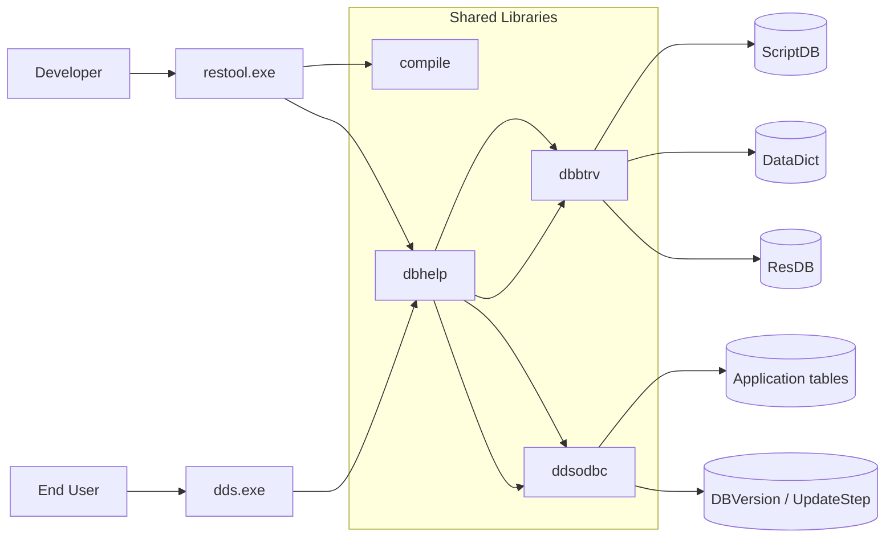
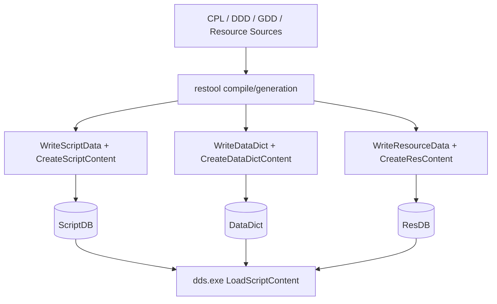

# ipos_kernel Architecture

## Scope

This document summarizes the architecture of the legacy DDS platform in `V200/V200.SRC`, with focus on:

- `dds.exe` runtime
- `restool.exe` IDE/tooling
- persistence model around `ScriptDB`, `DataDict`, and `ResDB`
- concrete DBBTRV operation usage reachable from RESTOOL flows

---

## 1) High-level system

The codebase builds a Win32 desktop stack with one main runtime executable and one development IDE executable:

- **`dds.exe`** (target `DDSMain`, output name `dds`)
  - end-user runtime
  - loads compiled script metadata/content and runs business logic
- **`restool.exe`** (target `restool`)
  - developer IDE for the CPL (Component Programming Language)
  - compiles/transforms sources and persists artifacts

Core shared libraries relevant to this area:

- **`dbhelp`**: table admin, request building, helper APIs for script/resource/datadict IO
- **`dbbtrv`**: Btrieve-backed DB implementation (`DBCall`, `DataRes_*`, `DataDict_*`)
- **`compile`**: compiler/transpilation pipeline consumed by RESTOOL and DDS

Backend routing is configurable via `DataBase` INI settings:

- `ResourceDLL` -> backend for `ScriptDB`/`ResDB`/`DataDict`
- `DefaultDLL` -> backend for `DBVersion`/`UpdateStep` and default transactional calls

---

## 2) Build topology in `V200/V200.SRC`

Parent CMake config declares:

- `DDSMain` executable (output `dds.exe`)
- many shared modules (`dbhelp`, `dbbtrv`, `ddsseq`, etc.)
- `restool` executable

Key project definitions:

- `V200/V200.SRC/CMakeLists.txt`
- `V200/V200.SRC/restool/CMakeLists.txt`
- `V200/V200.SRC/dbhelp/CMakeLists.txt`
- `V200/V200.SRC/dbbtrv/CMakeLists.txt`

`restool` links against `dbhelp`, `compile`, `ctool`, `frmobj`, `toolbar`, `statbar`, `dbclean`, and Win32 UI libs.

---

## 3) Persistence model used by RESTOOL + DDS

`dbhelp/RESSQL.CPP` defines SQL-style table metadata for core resource tables:

- **ScriptDB**
  - keys: autoincrement `Nummer`, unique (`Type`, `fName`)
  - stores script payload as blob (`Data`)
- **ResDB**
  - same structural pattern as ScriptDB for resource blobs
- **DataDict**
  - stores table definitions/version metadata (`TableID`, `Version`, parent info, `Data` blob)
- **DBVersion**, **UpdateStep**
  - lifecycle/update metadata
  - defined on the **DefaultDLL** path (not ResourceDLL)

RESTOOL artifact mapping:

- CPL compile artifacts -> **ScriptDB**
- DDD/GDD dictionary artifacts -> **DataDict**
- binary resources (bitmap/wmf/content) -> **ResDB**
- DB lifecycle/version metadata -> **DBVersion/UpdateStep** (primarily runtime/update layer via DefaultDLL)

DDS runtime startup loads and uses this persisted state (for example via `LoadScriptContent()`, `ReadDataDict()` checks for update flags).

---

## 4) RESTOOL artifact pipelines

### 4.1 Script pipeline

- RESTOOL UI triggers `GenerateScript(...)` (compile pass).
- Compiled script blob is written through `WriteScriptData(...)`.
- Script index/content container `_CONT` is rebuilt with `CreateScriptContent(...)`.
- DDS later loads script catalog via `LoadScriptContent()`.

### 4.2 Data dictionary pipeline

- Dictionary generation code (`GENDICT`, `GENGTBL`, `GENITBL`, `GENRTBL`) writes table definitions/versioned records.
- Uses `WriteDataDict(...)` plus `CreateDataDictContent()` and table checks (`CheckDataDictContent`).

### 4.3 Resource pipeline

- Resource compile stores bitmap/wmf through `StoreBitmap` / `StoreWMF`.
- Serialized resources are written via `WriteResourceData(...)`.
- Resource content index `_CONT` is generated by `CreateResContent()`.

---

## 5) DBBTRV operation usage from RESTOOL-related flows

There are two levels:

1. **Direct in RESTOOL** (`restool/DATACONV.CPX`)
2. **Indirect through dbhelp wrappers** (RESTOOL calls helper APIs that call `DBCall`)

### 5.1 Directly observed in RESTOOL code

`DATACONV.CPX` issues raw DB calls:

- `DBOP_GETFIRST`
- `DBOP_GETNEXT`
- `DBOP_INSERT`
- `DBOP_RESET`

This is used for source->destination row migration between handlers/tables.

### 5.2 Indirectly used through `dbhelp/RESSQL.CPP`

RESTOOL commonly uses helper functions (`Ask`, `Out`, `Read*`, `Write*`) that eventually invoke `DLLEntry::DBCall(...)`.

Observed underlying DB operation patterns:

- **`DBOP_GET`** for single-row select and for many write operations, with semantics controlled by request type:
  - `DBCALLTYPE_STANDARDGET`
  - `DBCALLTYPE_STANDARDINSERT`
  - `DBCALLTYPE_STANDARDUPDATE`
- **`DBOP_GETFIRST`** for execute-style statements (`DBCALLTYPE_EXECUTE`)
- **`DBOP_RESET`** after statements to release statement state

Additionally present in shared table-admin/conversion flows used by development/runtime tooling:

- `DBOP_ENDOFCONVERSION` (conversion finalization)

> Note: In this architecture, CRUD behavior is not encoded only by `DBOP_*`; it is also encoded by `DBCALLTYPE_*` on the request object.

### 5.3 Detailed DB operation matrix per module

Operation constants come from `Include/DBRECORD.HPP`:

- `DBOP_RESET`, `DBOP_GETFIRST`, `DBOP_GETNEXT`, `DBOP_GETLAST`, `DBOP_GETPREV`, `DBOP_DELETE`, `DBOP_INSERT`, `DBOP_UPDATE`, `DBOP_GET`, `DBOP_ENDOFCONVERSION`, ...
- `DBCALLTYPE_EXTENDED`, `DBCALLTYPE_STANDARDGET`, `DBCALLTYPE_STANDARDUPDATE`, `DBCALLTYPE_STANDARDDELETE`, `DBCALLTYPE_STANDARDINSERT`, `DBCALLTYPE_EXECUTE`, `DBCALLTYPE_TEST`, `DBCALLTYPE_CREATE`, ...

#### 5.3.1 RESTOOL module

| Module/file | Layer role | DBCALLTYPE used | DBOP used | Effective behavior |
|---|---|---|---|---|
| `restool/DATACONV.CPX` | Direct DB request/record migration | `DBCALLTYPE_EXTENDED` (source + destination requests) | `DBOP_GETFIRST`, `DBOP_GETNEXT`, `DBOP_INSERT`, `DBOP_RESET` | Iterates source rows and inserts transformed rows into destination table; explicit statement reset after loop |
| Other `restool/*` compilation flows (`GENDICT`, `GEN*`, `SHOWRES`, script dialogs, etc.) | Indirect via `dbhelp` APIs | via called helpers | via called helpers | Mostly call `WriteDataDict`, `WriteScriptData`, `WriteResourceData`, `Ask`, `Out`, `Create*Content`, not raw `DBCall` |

#### 5.3.2 DB helper modules used by RESTOOL

| Module/file | Primary exported helper surface | DBCALLTYPE used | DBOP used | Effective behavior |
|---|---|---|---|---|
| `dbhelp/RESSQL.CPP` | `Ask`, `Out`, `ReadScriptData`, `WriteScriptData`, `ReadResourceData`, `WriteResourceData`, `ReadDataDict`, `WriteDataDict`, `DelDataDict` | `STANDARDGET`, `EXECUTE`, `STANDARDINSERT`, `STANDARDUPDATE` | `DBOP_GET`, `DBOP_GETFIRST`, `DBOP_RESET` | Main CRUD adapter layer RESTOOL relies on. `Out(...)` uses request type to perform insert/update while opcode remains `DBOP_GET` |
| `dbhelp/RESADMIN.CPP` | `StoreBitmap`, `StoreWMF`, `CreateResContent`, `ReadResContent`, `GetResource` | (indirect via RESSQL helpers) | (indirect via RESSQL helpers) | Reads/writes ResDB blobs and resource content container `_CONT` |
| `dbhelp/SCRIPTHD.CPP` | `LoadScriptContent`, `CreateScriptContent`, `GetScriptEntry`, `UnloadScriptContent` | (indirect via RESSQL helpers) | (indirect via RESSQL helpers) | Reads script blobs/content index from ScriptDB and rebuilds cached script catalog |
| `dbhelp/TBDEF.CPP` | table admin / validation / conversion support | `DBCALLTYPE_TEST`, `DBCALLTYPE_CREATE`, `DBCALLTYPE_STANDARDINSERT` (+ internal end-of-conversion request) | `DBOP_GET`, `DBOP_RESET`, `DBOP_ENDOFCONVERSION` | DB testing/creation paths plus conversion lifecycle finalization |
| `dbhelp/DBLIST.CPP` | cursor/list traversal abstraction | built from request internals | `DBOP_GETFIRST`, `DBOP_GETLAST`, `DBOP_GETNEXT`, `DBOP_GETPREV`, `DBOP_GET`, `DBOP_RESET` | Encapsulates ordered cursor movement and paging/list behavior |
| `dbhelp/DBRECORD.CPP` | join-refresh / record relation maintenance | request from table/join descriptors | `DBOP_GET`, `DBOP_RESET` | Fetches joined row data on-demand and refreshes denormalized join fields |
| `dbhelp/REP.CPP` | replication helper routines | `DBCALLTYPE_CREATE`, `STANDARDINSERT`, `STANDARDUPDATE` (through `Out`) | `DBOP_GET`, `DBOP_RESET` | Replication and update operations for dependent records |

#### 5.3.3 Backend implementation side (for migration impact)

| Module/file | Role | DB operation relevance |
|---|---|---|
| `dbbtrv/OPBTRV.CPP`, `dbbtrv/OPBTRV1.CPP` | DBBTRV opcode dispatch and Btrieve mapping | Implements behavior for `DBOP_GET*`, `DBOP_INSERT`, `DBOP_UPDATE`, `DBOP_DELETE`, `DBOP_RESET`, `DBOP_ENDOFCONVERSION`, etc.; this is the main compatibility target when replacing backend behavior |

### 5.4 Practical interpretation for migration planning

For RESTOOL-centric development, the "must preserve first" operation set is:

- **Traversal/read path**: `DBOP_GETFIRST`, `DBOP_GETNEXT`, `DBOP_GETLAST`, `DBOP_GETPREV`, `DBOP_GET`
- **Write path**: `DBCALLTYPE_STANDARDINSERT`, `DBCALLTYPE_STANDARDUPDATE` (triggered through helper wrappers, often still sent as `DBOP_GET` request execution)
- **Lifecycle path**: `DBOP_RESET`, `DBOP_ENDOFCONVERSION`

This means backend migration tests must validate **both**:

1. opcode handling (`DBOP_*`)
2. request-type semantics (`DBCALLTYPE_*`)

because RESTOOL depends on their combined behavior.

### 5.5 Table-centric operation matrix (core development tables)

This matrix is focused on where each core table is read/written, and through which helper/operation style.

| Table | Main producer modules | Main consumer modules | Read patterns | Write/update/delete patterns | Underlying op semantics |
|---|---|---|---|---|---|
| `ScriptDB` | `compile/CODEGEN.CPP`, `dbhelp/SCRIPTHD.CPP` (`CreateScriptContent`) | `dbhelp/SCRIPTHD.CPP`, `dds.exe` startup/runtime (`LoadScriptContent`) | `ReadScriptData(...)`, `GetAllScriptData(...)`, `Ask(ScriptDB, ...)` | `WriteScriptData(...)` with upsert behavior (`Out(...STANDARDUPDATE...)` or `Out(...STANDARDINSERT...)`) | Reads/writes routed via `dbhelp/RESSQL.CPP`; execution mainly through `DBOP_GET` + request type, plus `DBOP_RESET` |
| `ResDB` | `dbhelp/RESADMIN.CPP` (`StoreBitmap`, `StoreWMF`, `CreateResContent`) | `restool/SHOWRES.CPP`, `restool/DIALED.CPP`, runtime resource loaders | `ReadResourceData(id,...)`, `ReadResourceData(type,name,...)`, `GetAllResourceData(...)`, `Ask(ResDB, ...)` | `WriteResourceData(...)` with update-or-insert via `Out(...)` | Same wrapper pattern in `RESSQL`: `DBOP_GET` for request execution + `DBOP_RESET` |
| `DataDict` | `restool/GENDICT.CPX`, `restool/GENGTBL.CPP`, `restool/GENITBL.CPP`, `restool/GENRTBL.CPP`, `dbhelp/TBDEF.CPP` (`CreateDataDictContent`) | `restool/DBTBLST.*`, `restool/TBLIST.CPP`, `dbhelp/TBDEF.CPP`, conversion/validation flows | `ReadDataDict(...)`, `GetAllDataDict(...)`, `Ask(DataDict,...)`, `CheckDataDictContent(...)` | `WriteDataDict(...)` (new/versioned defs), `DelDataDict(...)` (cleanup/replace old versions) | Versioned dictionary lifecycle; request execution via same DBCall abstraction (`DBOP_GET`/`RESET`) plus conversion marker use (`DBOP_ENDOFCONVERSION`) |
| `DBVersion` | `dbhelp/RESSQL.CPP` (`SetDBVersion`) | `dbhelp/TBDEF.CPP` test/convert flows, runtime update checks | `GetDBVersionList(...)`, `Ask(DBVersion, "Name = %1", ...)` | `SetDBVersion(...)` performs update-or-insert using `Out(...)` | Bound to **DefaultDLL** (`DefineResourceDBs` uses `LoadDefaultDLL()` for `DBVersion`), so backend is configurable (e.g. `ddsodbc.dll`) |
| `UpdateStep` | update/conversion runtime layer in `dbhelp/RESSQL.CPP` (`DBUpdate` table definition) | update diagnostics/history readers | generic table/query access over DB helpers | insert/update lifecycle records through DB helper abstraction | Bound to **DefaultDLL** (`LoadDefaultDLL()`), not to ResourceDLL; separate from RESTOOL writing DataDict type `5` update trigger records |

#### 5.5.1 Quick migration priority by table (dbbtrv/ResourceDLL scope)

1. **Highest criticality**: `ScriptDB`, `DataDict` (directly affects compile+runtime correctness).
2. **High**: `ResDB` (IDE/runtime asset loading and UI behavior).

Recommended regression order (for dbbtrv/ResourceDLL migration):

1. `ScriptDB` read/write parity (including `_CONT` rebuild behavior)
2. `DataDict` versioned write/read/delete parity
3. `ResDB` binary blob round-trip parity (bitmap/wmf/content)

#### 5.5.2 Update mechanism scope (DefaultDLL / ddsodbc path)

`DBVersion` and `UpdateStep` should be treated as **DDS updater mechanism tables**, not as RESTOOL/resource-db tables:

- backend path: **DefaultDLL** (in your configuration `MV2=ddsodbc.dll`)
- orchestration: updater logic executed by **`dds.exe`**
- purpose:
  - `DBVersion`: tracks effective version per logical table
  - `UpdateStep`: logs/records update progression
- related behavior:
  - versioned table handling from DDD-driven metadata
  - DDL execution against the DefaultDLL database during update

So for planning: keep `DBVersion`/`UpdateStep` in a **separate updater validation track**, independent from `dbbtrv` replacement work.

---

## 6) Key architectural seams for migration work

For dbbtrv-to-new-backend migration or compatibility work, the highest-value seams are:

1. **`DLLEntry::DBCall` contract** (operation + request-type semantics)
2. **`DataRes_*` and `DataDict_*` APIs** exposed through `DLLADMIN` indirection
3. **`Read*/Write*` helper surface in `dbhelp/RESSQL.CPP`**
4. **RESTOOL direct DB calls in `DATACONV.CPX`** (explicit opcodes)

Keeping these contracts stable preserves interoperability between:

- RESTOOL generation workflows,
- DDS runtime loading/execution,
- legacy Btrieve-style storage behavior.
